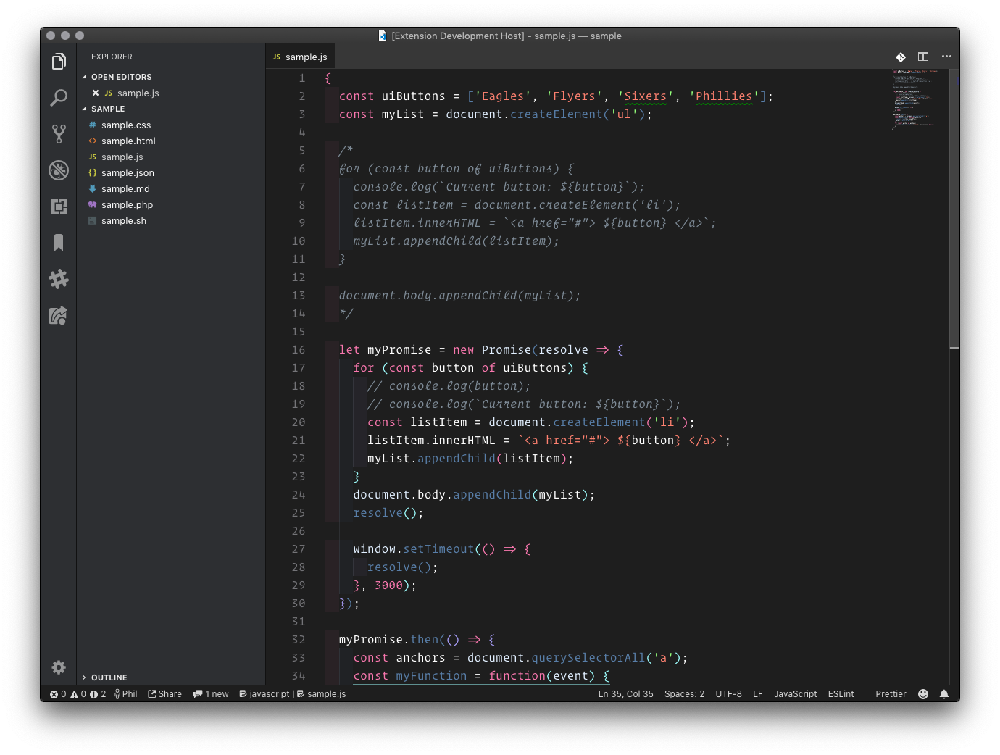
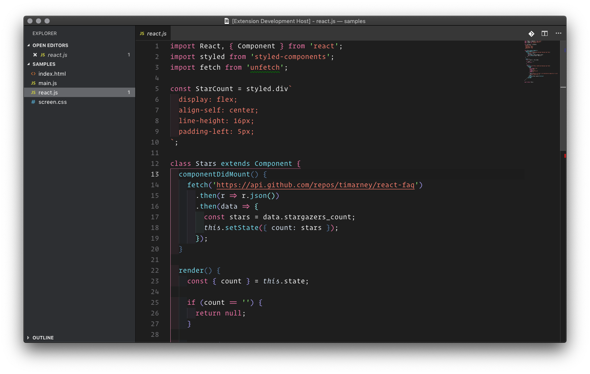
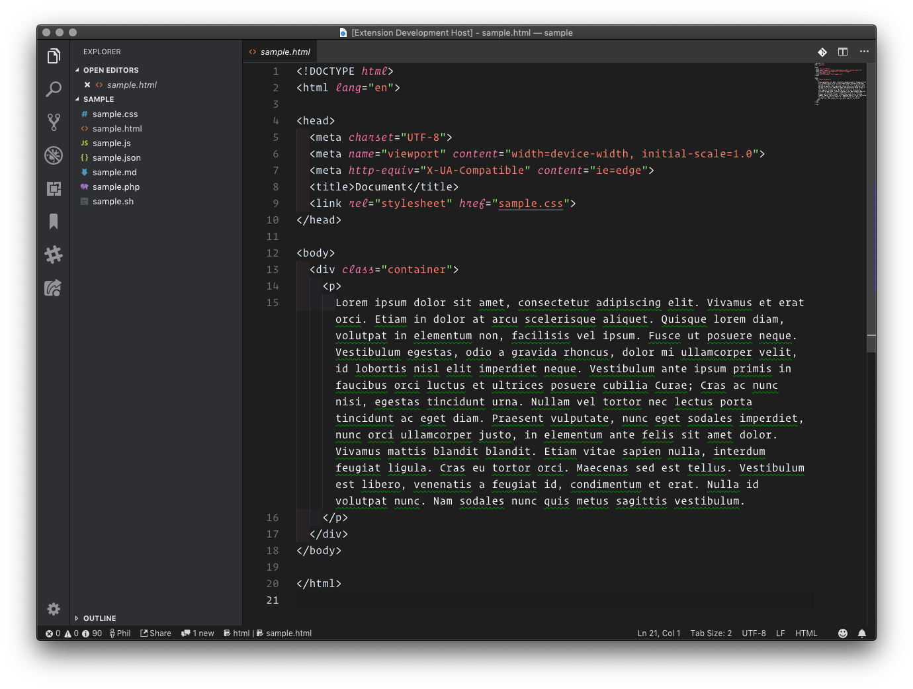
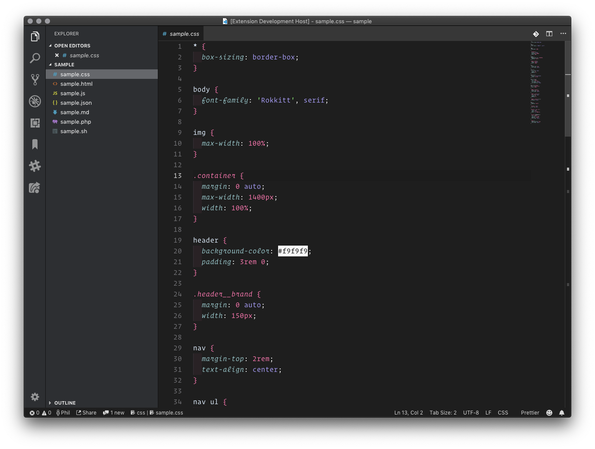
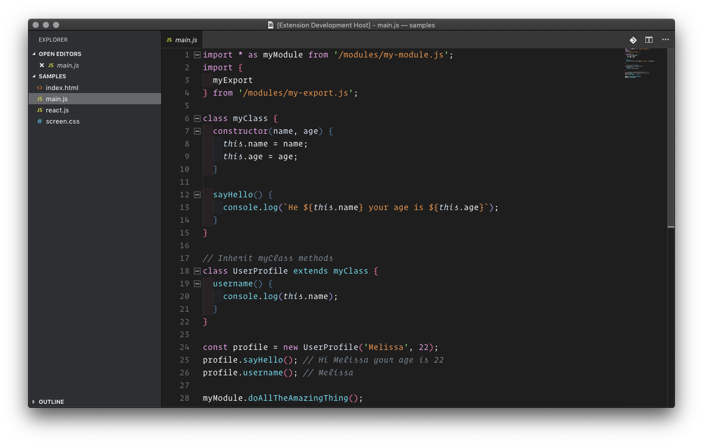
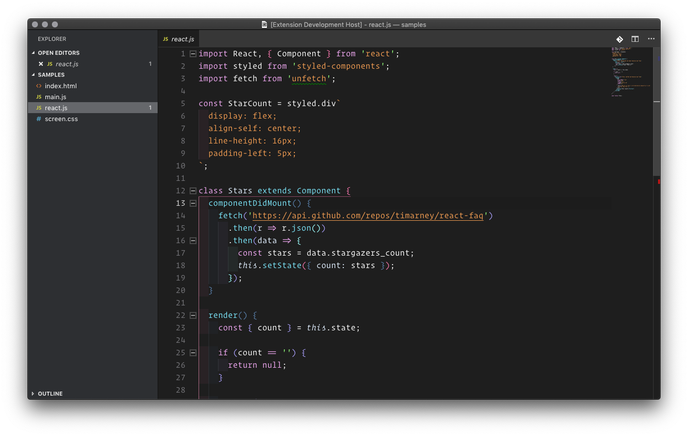
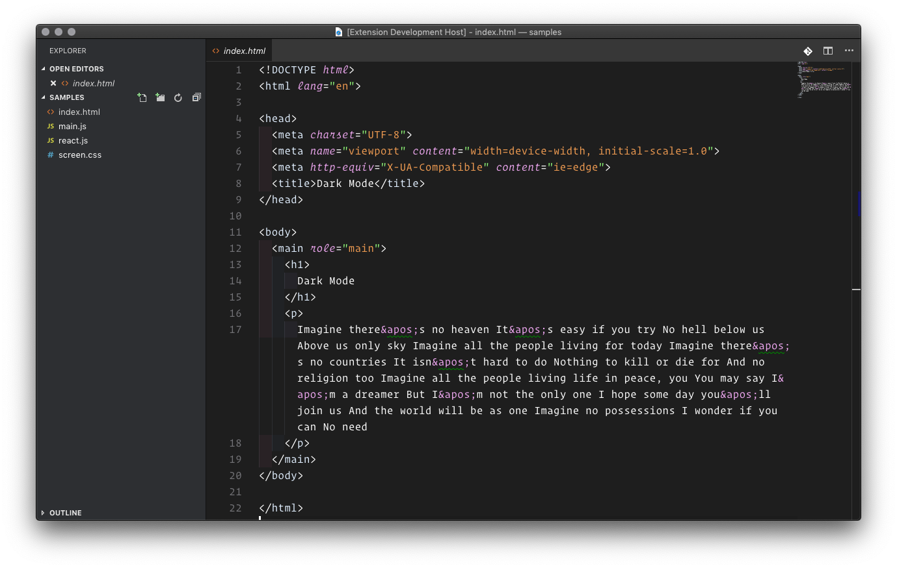

# README

## About

A VSCode theme designed for macOS Dark Mode. There are two versions of the theme. The first is based on the XCode dark mode color scheme, the second uses slightly warmer values for the orange and pink shades, and is based on recent devtools updates to the OS dark mode color scheme.

## Screenshots

### JavaScript



### React



### HTML



### CSS



### JavaScript - Warm



### React - Warm



### HTML - Warm



### CSS - Warm


## Related Customization

### Colors for [Bracket Pair Colorizer](https://marketplace.visualstudio.com/items?itemName=CoenraadS.bracket-pair-colorizer)

```json
"bracketPairColorizer.consecutivePairColors": [
  "()",
  "[]",
  "{}",
  ["#f977ae", "#587EA8", "#a79df7", "#9effff"],
  "#f2e5bc"
]
```

### Colors for [Indent Rainbow](https://marketplace.visualstudio.com/items?itemName=oderwat.indent-rainbow)

```json
"indentRainbow.colors": [
  "rgba(251, 118, 175, 0.05)",
  "rgba(88, 125, 169, 0.05)",
  "rgba(168, 154, 249, 0.05)",
  "rgba(156, 255, 255, 0.05)"
]
```

## Theme Icons

Theme icon options original from [David Waters MacOS Modern VSCode Theme](https://github.com/davidbwaters/macos-modern-vscode-theme)